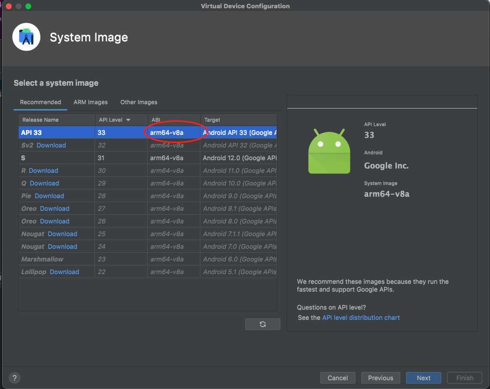

# How to setup Android on an M1 Macbook

## Step 1: Update the project to RN 63.4

Firstly make sure the React Native upgrade from 61.3 to 63.4 has been applied to the project as per the example MR here: https://gitlab.builder.ai/clientprojects/assembler_projects/prd/cashwala-242572-react-native/-/merge_requests/65/diffs

**Note:** When updating do not apply the changes to the project.pbxproj file manually. These will be automatically done once the other changes are in place.

Once you have made the changes be sure to wipe the `/node_modules` folder before running yarn for a completely fresh install. If you see an error at the end of the install that a patch could not be applied then run the following command:

`patch -p1 -i patches/react-native-safe-area-view+0.11.0.patch`

## Step 2: Get the right JDK

We highly recommend using the Azul Zulu distribution of the Java Development Kit as it has better support for M1 macs than the standard distribution. This can be easily installed via Homebrew as below (although be sure to remove any pre-installed JDKs if required):

`brew tap homebrew/cask-versions`

`brew install --cask zulu11`

## Step 3: Ensure Android Studio is installed correctly

Then make sure you have the correct version of Android Studio installed for M1 macs (the _mac_arm.dmg_ rather than the standard _mac.dmg_): https://developer.android.com/studio#downloads

When creating your virtual device in Android Studio use the latest version of the API (33 at time of writing) and make sure that the ABI is the arm64 version (see screenshot below). We would also recommend that you "cold boot" the device from the drop down menu within Android Studio’s device manager first before starting the project.

## Step 4: Clear gradle caches

Finally, make sure that after making the above changes you clear your gradle cache before retrying. This can be done by navigating to the /packages/mobile/android folder within your project and running

`./gradlew clean`

Also delete any `.gradle` folder within the /src directory.
